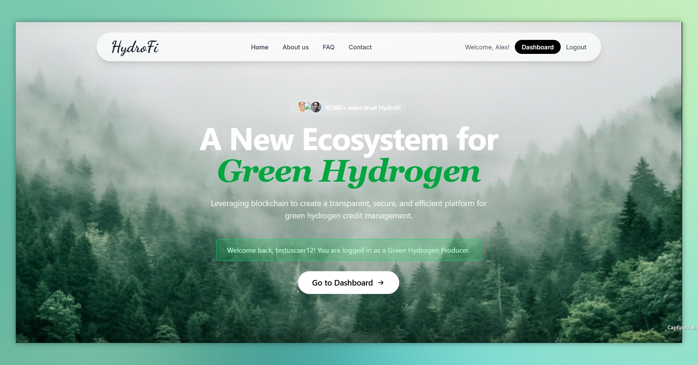

# 🚀 HydroFi - Green Hydrogen Credit System

A **full-stack MERN** application for managing green hydrogen production, certification, and carbon credit trading.

   

---

## 👀 Take a look




---

## 🛠️ Features

- 🔐 **User Authentication:** Secure JWT-based authentication with role-based access
- 📊 **Role-Based Dashboards:** Tailored interfaces for each user type
- ⛓️ **Blockchain Integration:** ERC-1155 smart contracts for green hydrogen credits
- 💰 **Token Management:** Mint, transfer, and retire carbon credits
- 🔄 **Real-time Data:** Dynamic dashboard content based on user roles
- 🔑 **Transfer by Identifier:** Transfer tokens using username or factory ID
- 📜 **Audit Trail:** Complete transaction history and ownership tracking
- 📱 **Responsive Design:** Modern UI compatible with all devices

---

## ⛓️ Blockchain Features

- 🌐 **ERC-1155 Multi-Token Standard:** Efficient batch operations & metadata support
- 💨 **Green Hydrogen Credits:** Each token represents verified green hydrogen production
- 🕵️ **Ownership Tracking:** Full history of token creation, transfers & retirement
- 🏭 **Factory-Based Minting:** Tokens linked to specific production facilities
- 🛑 **Pausable Contract:** Emergency stop functionality for compliance
- 🗂️ **Metadata Storage:** Rich token info including production details

---

## 👥 User Roles

| Role                       | Description                                             |
| -------------------------- | ------------------------------------------------------- |
| 🏭 Green Hydrogen Producer | Manage production & mint carbon credits                 |
| 🏛️ Regulatory Authority    | Oversee compliance, audit transactions, advanced search |
| 🛒 Industry Buyer          | Purchase and manage carbon credit portfolios            |
| ✅ Certification Body      | Conduct inspections and issue certifications            |

---

## 💻 Technology Stack

### Backend

- Node.js & Express.js
- MongoDB with Mongoose
- JWT for authentication
- bcryptjs for password hashing

### Frontend

- React 18 with Vite
- React Router for navigation
- Axios for API calls
- Context API for state management

---

## ⚙️ Installation and Setup

### Prerequisites

- Node.js (v16+)
- MongoDB (local or Atlas)
- npm or yarn

### Blockchain/Smart Contract Setup

```
cd contracts
npm install
```

Create `.env` with:

```
PRIVATE_KEY=0xac0974... # Replace for production
```

Start Hardhat local network:

```
npx hardhat node
```

Deploy contract:

```
npx hardhat run scripts/deploy.js --network localhost
```

(Optional) List accounts:

```
npx hardhat run scripts/list-accounts.js --network localhost
```

### Backend Setup

```
cd backend
npm install
```

Create `.env` with:

```
PORT=5000
MONGODB_URI=mongodb://localhost:27017/hydrofi_db
JWT_SECRET=your_super_secret_jwt_key_here_change_in_production
BLOCKCHAIN_RPC_URL=http://localhost:8545
WALLET_PRIVATE_KEY=0xac0974...
DEFAULT_WALLET_ADDRESS=0xf39Fd6e51aad88F6F4ce6aB8827279cffFb92266
```

Run wallet migration (if needed):

```
node migrate-wallets.js
```

Start backend server:

```
npm run dev
```

### Frontend Setup

```
cd frontend
npm install
npm run dev
```

Access app at:

- Frontend: [http://localhost:3000](http://localhost:3000)
- Backend API: [http://localhost:5000](http://localhost:5000)
- Blockchain: [http://localhost:8545](http://localhost:8545)

---

## 🛠️ Troubleshooting & Verification

### Common Issues

| Issue                     | Fix                                                                   |
| ------------------------- | --------------------------------------------------------------------- |
| Contract deployment fails | Ensure Hardhat node is running and port 8545 is free                  |
| Backend can't connect     | Verify `.env` URLs, ensure contract deployed, Hardhat node running    |
| Tokens not appearing      | Check console errors, unique wallet addresses, emitted events         |
| Transfers fail            | Verify recipient exists & token ownership, check blockchain stability |

### Setup Verification

- ✅ Hardhat node mining activity on transactions
- ✅ Contract deployed with visible address
- ✅ Backend logs "Blockchain service initialized successfully"
- ✅ Frontend registration & login working

---

## 📡 Development Commands

```
# Reset blockchain data
cd contracts
npx hardhat clean
npx hardhat node

# Redeploy contract
npx hardhat run scripts/deploy.js --network localhost

# List accounts
npx hardhat run scripts/list-accounts.js --network localhost
```

---

## 🔗 API Endpoints

### Authentication

| Endpoint                  | Description                  |
| ------------------------- | ---------------------------- |
| POST `/api/auth/register` | Register a new user          |
| POST `/api/auth/login`    | Login user                   |
| GET `/api/auth/me`        | Get current user (protected) |

### Dashboard

| Endpoint                           | Description                           |
| ---------------------------------- | ------------------------------------- |
| GET `/api/dashboard/data`          | Role-based dashboard data (protected) |
| GET `/api/dashboard/producer`      | Producer-specific data (protected)    |
| GET `/api/dashboard/regulatory`    | Regulatory data (protected)           |
| GET `/api/dashboard/buyer`         | Buyer data (protected)                |
| GET `/api/dashboard/certification` | Certification data (protected)        |

---

## 📝 Usage Guide

1. 📝 Register with selected role & credentials
2. 🔐 Login to access role-specific dashboard
3. 📊 View and manage data/actions as per role
4. 🔄 Navigate using the navbar; logout when done

---

## 📂 Project Structure

```
HydroFi_Final/
├── backend/
│   ├── middleware/auth.js
│   ├── models/User.js, Transaction.js
│   ├── routes/auth.js, dashboard.js, blockchain.js
│   ├── services/blockchainService.js
│   ├── contract-data.json, migrate-wallets.js, .env, package.json, server.js
├── contracts/
│   ├── contracts/GreenHydrogenCredits.sol
│   ├── scripts/deploy.js, list-accounts.js
│   ├── artifacts/, cache/, .env, hardhat.config.js, package.json
└── frontend/
    ├── src/components/auth/, dashboards/, EnhancedTransferComponent.jsx, WalletHelper.jsx, Home.jsx, Navbar.jsx
    ├── contexts/AuthContext.jsx, BlockchainContext.jsx
    ├── App.jsx, index.css, main.jsx
    ├── index.html, package.json, vite.config.js
```

---

## 🔐 Security Features

- 🔒 Password hashing with bcryptjs
- 🧩 JWT-based stateless authentication
- 🛡️ Role-based route protection
- 🧹 Input validation & sanitization
- 🌍 CORS configuration

---

## 🚀 Future Enhancements

- ⛓️ Real blockchain integration
- 📈 Advanced analytics & reporting
- 🔔 Real-time notifications
- 📁 Certificate file uploads
- 🔍 Advanced search & filtering
- 📧 Email verification & password reset

---

## 🤝 Contributing

1. 🍴 Fork the repository
2. 🌿 Create a feature branch
3. 💾 Commit changes
4. 🚀 Push to branch
5. 🔃 Create a Pull Request

---

## 📄 License

This project is licensed under the MIT License.  


---
