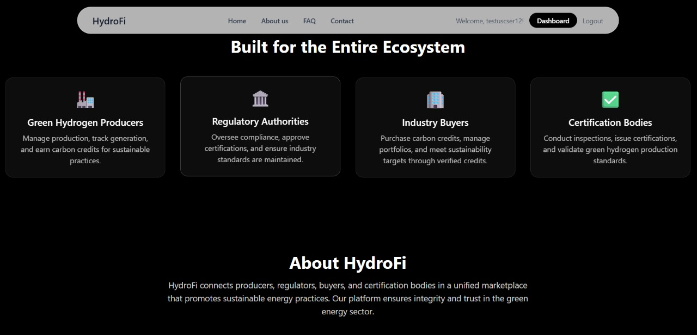

# 🚀 HydroFi - Green Hydrogen Credit System

A **full-stack MERN** application for managing green hydrogen production, certification, and carbon credit trading.

   


## 👀 Take a look




---

## 🛠️ Features

- 🔐 **User Authentication:** Secure JWT-based authentication with role-based access
- 📊 **Role-Based Dashboards:** Tailored interfaces for each user type
- ⛓️ **Blockchain Integration:** ERC-1155 smart contracts for green hydrogen credits
- 💰 **Token Management:** Mint, transfer, and retire carbon credits
- 🔄 **Real-time Data:** Dynamic dashboard content based on user roles
- 🔑 **Transfer by Identifier:** Transfer tokens using username or factory ID
- 📜 **Audit Trail:** Complete transaction history and ownership tracking
- 📱 **Responsive Design:** Modern UI compatible with all devices

---

## ⛓️ Blockchain Features

- 🌐 **ERC-1155 Multi-Token Standard:** Efficient batch operations & metadata support
- 💨 **Green Hydrogen Credits:** Each token represents verified green hydrogen production
- 🕵️ **Ownership Tracking:** Full history of token creation, transfers & retirement
- 🏭 **Factory-Based Minting:** Tokens linked to specific production facilities
- 🛑 **Pausable Contract:** Emergency stop functionality for compliance
- 🗂️ **Metadata Storage:** Rich token info including production details

---

## 🔄 How This Website Works

### 🎯 **Complete Workflow Overview**

HydroFi operates as a **comprehensive ecosystem** for green hydrogen credit management, connecting producers, buyers, regulators, and certification bodies in a transparent, blockchain-powered marketplace.

#### 🏭 **Producer Workflow**

1. **🔐 Registration & Setup**

   - Producer registers with factory details
   - System auto-generates unique **Factory ID** (e.g., `ABCD3057723X`)
   - Receives dedicated **wallet address** for blockchain operations
   - Profile includes production capacity, location, and certifications

2. **⚡ Production & Minting**

   - Producer completes hydrogen production cycle
   - Mints **ERC-1155 tokens** representing verified green hydrogen credits
   - Each token contains immutable metadata: production date, quantity, factory ID
   - Blockchain records creation timestamp and producer identity

3. **📊 Dashboard Management**

   - Monitor **active credit inventory** in real-time
   - Track **production statistics** and historical data
   - View **token ownership history** and transfer records
   - Access **compliance reports** and certification status

4. **💼 Credit Trading**
   - Transfer credits using **username/Factory ID** (simplified) or wallet addresses
   - Set **transfer conditions** and recipient verification
   - Real-time **transaction notifications** and confirmations
   - Maintain **audit trail** for regulatory compliance

#### 🏛️ **Admin/Regulatory Workflow**

1. **🔍 System Oversight**

   - **Advanced search** across all tokens, factories, and transactions
   - **Real-time monitoring** of market activity and compliance
   - **Export capabilities** for regulatory reporting and analysis
   - **User management** and role-based access control

2. **📈 Analytics & Reporting**

   - **Market intelligence** with production trends and trading patterns
   - **Compliance tracking** with automated violation detection
   - **Statistical dashboards** showing system-wide metrics
   - **Custom reports** for stakeholders and government agencies

3. **🛡️ Fraud Prevention**
   - **Blockchain verification** of all transactions and ownership
   - **Double-spending prevention** through token retirement
   - **Identity verification** and factory authentication
   - **Suspicious activity alerts** and investigation tools

### 🗺️ **Interactive Map Feature**

#### 📍 **Global Production Visualization**

- **Interactive world map** showing green hydrogen production facilities
- **Real-time data points** with production capacity and status indicators
- **Factory clustering** in high-density regions with zoom capabilities
- **Regional statistics** showing production volumes and market activity

#### 🎯 **Map Functionality**

- **Click-to-explore** factory details, production history, and certifications
- **Filter options** by production capacity, certification status, and activity level
- **Trade route visualization** showing credit transfer patterns between regions
- **Market heat maps** indicating high-activity trading zones

#### 📊 **Geographic Intelligence**

- **Regional compliance** tracking with jurisdiction-specific requirements
- **Supply chain mapping** from production to end-use consumption
- **Logistics optimization** for physical hydrogen delivery coordination
- **Market penetration** analysis by geographic region

### 🧠 **Trade Intelligence System**

#### 📈 **Smart Analytics Engine**

- **Machine learning algorithms** analyzing trading patterns and market trends
- **Price discovery mechanisms** based on supply, demand, and quality metrics
- **Predictive modeling** for future market conditions and pricing
- **Risk assessment** tools for credit quality and counterparty evaluation

#### 💡 **Intelligent Insights**

- **Market recommendations** for optimal trading timing and strategies
- **Quality scoring** based on production methods, certifications, and history
- **Demand forecasting** using historical data and industry trends
- **Portfolio optimization** suggestions for buyers and investors

#### 🔄 **Automated Features**

- **Smart notifications** for market opportunities and price alerts
- **Automated compliance** checking for regulatory requirements
- **Trade matching** algorithms connecting buyers with suitable sellers
- **Dynamic pricing** recommendations based on real-time market data

#### � **Business Intelligence Dashboard**

- **Real-time market metrics** including volume, pricing, and activity
- **Trend analysis** with interactive charts and historical comparisons
- **Performance benchmarking** against industry standards and competitors
- **Custom KPI tracking** for individual organizations and market segments

### 🔗 **Integration Ecosystem**

- **API connectivity** for third-party systems and enterprise integration
- **Webhook notifications** for real-time updates and automation
- **Data export** capabilities for external analytics and reporting
- **Compliance integration** with regulatory systems and standards

- 🔐 **User Authentication:** Secure JWT-based authentication with role-based access
- 📊 **Role-Based Dashboards:** Tailored interfaces for each user type
- ⛓️ **Blockchain Integration:** ERC-1155 smart contracts for green hydrogen credits
- 💰 **Token Management:** Mint, transfer, and retire carbon credits
- 🔄 **Real-time Data:** Dynamic dashboard content based on user roles
- 🔑 **Transfer by Identifier:** Transfer tokens using username or factory ID
- 📜 **Audit Trail:** Complete transaction history and ownership tracking
- 📱 **Responsive Design:** Modern UI compatible with all devices

---

## ⛓️ Blockchain Features

- 🌐 **ERC-1155 Multi-Token Standard:** Efficient batch operations & metadata support
- 💨 **Green Hydrogen Credits:** Each token represents verified green hydrogen production
- 🕵️ **Ownership Tracking:** Full history of token creation, transfers & retirement
- 🏭 **Factory-Based Minting:** Tokens linked to specific production facilities
- 🛑 **Pausable Contract:** Emergency stop functionality for compliance
- 🗂️ **Metadata Storage:** Rich token info including production details

---

## � How This Website Works

### 🎯 **Complete Workflow Overview**

HydroFi operates as a **comprehensive ecosystem** for green hydrogen credit management, connecting producers, buyers, regulators, and certification bodies in a transparent, blockchain-powered marketplace.

#### 🏭 **Producer Workflow**

1. **🔐 Registration & Setup**

   - Producer registers with factory details
   - System auto-generates unique **Factory ID** (e.g., `ABCD3057723X`)
   - Receives dedicated **wallet address** for blockchain operations
   - Profile includes production capacity, location, and certifications

2. **⚡ Production & Minting**

   - Producer completes hydrogen production cycle
   - Mints **ERC-1155 tokens** representing verified green hydrogen credits
   - Each token contains immutable metadata: production date, quantity, factory ID
   - Blockchain records creation timestamp and producer identity

3. **📊 Dashboard Management**

   - Monitor **active credit inventory** in real-time
   - Track **production statistics** and historical data
   - View **token ownership history** and transfer records
   - Access **compliance reports** and certification status

4. **💼 Credit Trading**
   - Transfer credits using **username/Factory ID** (simplified) or wallet addresses
   - Set **transfer conditions** and recipient verification
   - Real-time **transaction notifications** and confirmations
   - Maintain **audit trail** for regulatory compliance

#### 🏛️ **Admin/Regulatory Workflow**

1. **🔍 System Oversight**

   - **Advanced search** across all tokens, factories, and transactions
   - **Real-time monitoring** of market activity and compliance
   - **Export capabilities** for regulatory reporting and analysis
   - **User management** and role-based access control

2. **📈 Analytics & Reporting**

   - **Market intelligence** with production trends and trading patterns
   - **Compliance tracking** with automated violation detection
   - **Statistical dashboards** showing system-wide metrics
   - **Custom reports** for stakeholders and government agencies

3. **🛡️ Fraud Prevention**
   - **Blockchain verification** of all transactions and ownership
   - **Double-spending prevention** through token retirement
   - **Identity verification** and factory authentication
   - **Suspicious activity alerts** and investigation tools

### 🗺️ **Interactive Map Feature**

#### 📍 **Global Production Visualization**

- **Interactive world map** showing green hydrogen production facilities
- **Real-time data points** with production capacity and status indicators
- **Factory clustering** in high-density regions with zoom capabilities
- **Regional statistics** showing production volumes and market activity

#### 🎯 **Map Functionality**

- **Click-to-explore** factory details, production history, and certifications
- **Filter options** by production capacity, certification status, and activity level
- **Trade route visualization** showing credit transfer patterns between regions
- **Market heat maps** indicating high-activity trading zones

#### 📊 **Geographic Intelligence**

- **Regional compliance** tracking with jurisdiction-specific requirements
- **Supply chain mapping** from production to end-use consumption
- **Logistics optimization** for physical hydrogen delivery coordination
- **Market penetration** analysis by geographic region

### 🧠 **Trade Intelligence System**

#### 📈 **Smart Analytics Engine**

- **Machine learning algorithms** analyzing trading patterns and market trends
- **Price discovery mechanisms** based on supply, demand, and quality metrics
- **Predictive modeling** for future market conditions and pricing
- **Risk assessment** tools for credit quality and counterparty evaluation

#### 💡 **Intelligent Insights**

- **Market recommendations** for optimal trading timing and strategies
- **Quality scoring** based on production methods, certifications, and history
- **Demand forecasting** using historical data and industry trends
- **Portfolio optimization** suggestions for buyers and investors

#### 🔄 **Automated Features**

- **Smart notifications** for market opportunities and price alerts
- **Automated compliance** checking for regulatory requirements
- **Trade matching** algorithms connecting buyers with suitable sellers
- **Dynamic pricing** recommendations based on real-time market data

#### 📊 **Business Intelligence Dashboard**

- **Real-time market metrics** including volume, pricing, and activity
- **Trend analysis** with interactive charts and historical comparisons
- **Performance benchmarking** against industry standards and competitors
- **Custom KPI tracking** for individual organizations and market segments

### 🔗 **Integration Ecosystem**

- **API connectivity** for third-party systems and enterprise integration
- **Webhook notifications** for real-time updates and automation
- **Data export** capabilities for external analytics and reporting
- **Compliance integration** with regulatory systems and standards
- **Automated compliance** checking for regulatory requirements
- **Trade matching** algorithms connecting buyers with suitable sellers
- **Dynamic pricing** recommendations based on real-time market data

#### 📊 **Business Intelligence Dashboard**

- **Real-time market metrics** including volume, pricing, and activity
- **Trend analysis** with interactive charts and historical comparisons
- **Performance benchmarking** against industry standards and competitors
- **Custom KPI tracking** for individual organizations and market segments

### 🔗 **Integration Ecosystem**

- **API connectivity** for third-party systems and enterprise integration
- **Webhook notifications** for real-time updates and automation
- **Data export** capabilities for external analytics and reporting
- **Compliance integration** with regulatory systems and standards

---

## �👥 User Roles

| Role                       | Description                                             |
| -------------------------- | ------------------------------------------------------- |
| 🏭 Green Hydrogen Producer | Manage production & mint carbon credits                 |
| 🏛️ Regulatory Authority    | Oversee compliance, audit transactions, advanced search |
| 🛒 Industry Buyer          | Purchase and manage carbon credit portfolios            |
| ✅ Certification Body      | Conduct inspections and issue certifications            |

---

## 💻 Technology Stack

### Backend

- Node.js & Express.js
- MongoDB with Mongoose
- JWT for authentication
- bcryptjs for password hashing

### Frontend

- React 18 with Vite
- React Router for navigation
- Axios for API calls
- Context API for state management

---

## ⚙️ Installation and Setup

### Prerequisites

- Node.js (v16+)
- MongoDB (local or Atlas)
- npm or yarn

### Blockchain/Smart Contract Setup

```
cd contracts
npm install
```

Create `.env` with:

```
PRIVATE_KEY=0xac0974... # Replace for production
```

Start Hardhat local network:

```
npx hardhat node
```

Deploy contract:

```
npx hardhat run scripts/deploy.js --network localhost
```

(Optional) List accounts:

```
npx hardhat run scripts/list-accounts.js --network localhost
```

### Backend Setup

```
cd backend
npm install
```

Create `.env` with:

```
PORT=5000
MONGODB_URI=mongodb://localhost:27017/hydrofi_db
JWT_SECRET=your_super_secret_jwt_key_here_change_in_production
BLOCKCHAIN_RPC_URL=http://localhost:8545
WALLET_PRIVATE_KEY=0xac0974...
DEFAULT_WALLET_ADDRESS=0xf39Fd6e51aad88F6F4ce6aB8827279cffFb92266
```

Run wallet migration (if needed):

```
node migrate-wallets.js
```

Start backend server:

```
npm run dev
```

### Frontend Setup

```
cd frontend
npm install
npm run dev
```

Access app at:

- Frontend: [http://localhost:3000](http://localhost:3000)
- Backend API: [http://localhost:5000](http://localhost:5000)
- Blockchain: [http://localhost:8545](http://localhost:8545)

---

## 🛠️ Troubleshooting & Verification

### Common Issues

| Issue                     | Fix                                                                   |
| ------------------------- | --------------------------------------------------------------------- |
| Contract deployment fails | Ensure Hardhat node is running and port 8545 is free                  |
| Backend can't connect     | Verify `.env` URLs, ensure contract deployed, Hardhat node running    |
| Tokens not appearing      | Check console errors, unique wallet addresses, emitted events         |
| Transfers fail            | Verify recipient exists & token ownership, check blockchain stability |

### Setup Verification

- ✅ Hardhat node mining activity on transactions
- ✅ Contract deployed with visible address
- ✅ Backend logs "Blockchain service initialized successfully"
- ✅ Frontend registration & login working

---

## 📡 Development Commands

```
# Reset blockchain data
cd contracts
npx hardhat clean
npx hardhat node

# Redeploy contract
npx hardhat run scripts/deploy.js --network localhost

# List accounts
npx hardhat run scripts/list-accounts.js --network localhost
```

---

## 🔗 API Endpoints

### Authentication

| Endpoint                  | Description                  |
| ------------------------- | ---------------------------- |
| POST `/api/auth/register` | Register a new user          |
| POST `/api/auth/login`    | Login user                   |
| GET `/api/auth/me`        | Get current user (protected) |

### Dashboard

| Endpoint                           | Description                           |
| ---------------------------------- | ------------------------------------- |
| GET `/api/dashboard/data`          | Role-based dashboard data (protected) |
| GET `/api/dashboard/producer`      | Producer-specific data (protected)    |
| GET `/api/dashboard/regulatory`    | Regulatory data (protected)           |
| GET `/api/dashboard/buyer`         | Buyer data (protected)                |
| GET `/api/dashboard/certification` | Certification data (protected)        |

---

## 📝 Usage Guide

1. 📝 Register with selected role & credentials
2. 🔐 Login to access role-specific dashboard
3. 📊 View and manage data/actions as per role
4. 🔄 Navigate using the navbar; logout when done

---

## 📂 Project Structure

```
HydroFi_Final/
├── backend/
│   ├── middleware/auth.js
│   ├── models/User.js, Transaction.js
│   ├── routes/auth.js, dashboard.js, blockchain.js
│   ├── services/blockchainService.js
│   ├── contract-data.json, migrate-wallets.js, .env, package.json, server.js
├── contracts/
│   ├── contracts/GreenHydrogenCredits.sol
│   ├── scripts/deploy.js, list-accounts.js
│   ├── artifacts/, cache/, .env, hardhat.config.js, package.json
└── frontend/
    ├── src/components/auth/, dashboards/, EnhancedTransferComponent.jsx, WalletHelper.jsx, Home.jsx, Navbar.jsx
    ├── contexts/AuthContext.jsx, BlockchainContext.jsx
    ├── App.jsx, index.css, main.jsx
    ├── index.html, package.json, vite.config.js
```

---

## 🔐 Security Features

- 🔒 Password hashing with bcryptjs
- 🧩 JWT-based stateless authentication
- 🛡️ Role-based route protection
- 🧹 Input validation & sanitization
- 🌍 CORS configuration

---

## 🚀 Future Enhancements

- ⛓️ Real blockchain integration
- 📈 Advanced analytics & reporting
- 🔔 Real-time notifications
- 📁 Certificate file uploads
- 🔍 Advanced search & filtering
- 📧 Email verification & password reset

---

## 🤝 Contributing

1. 🍴 Fork the repository
2. 🌿 Create a feature branch
3. 💾 Commit changes
4. 🚀 Push to branch
5. 🔃 Create a Pull Request

---

## 📄 License

This project is licensed under the MIT License.  


---
